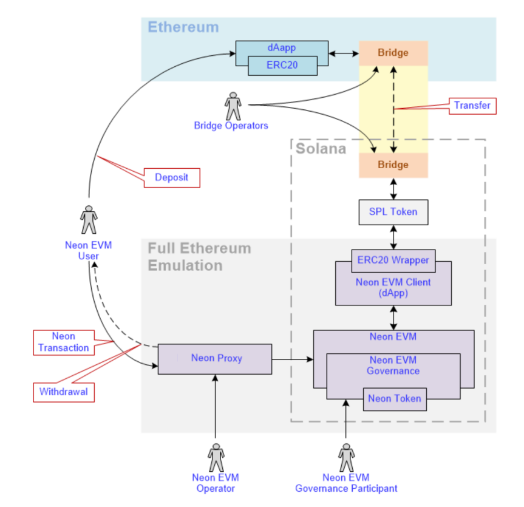

Neon EVM is an implementation of the Ethereum Virtual Machine on Solana, i.e. as a Solana
smart-contract/program
<https://github.com/neonevm/neon-evm>

# Architecture

- **Neon EVM**  
  An EVM that represents a smart contract written in Rust and compiled into the BPF bytecode of a VM running on Solana.
- **Neon EVM user**  
  Any user who has an account in Neon EVM with a balance in NEON, ERC-20 and ERC-721 tokens.
- **Neon EVM client**  
  Any application that has an EVM (Solidity, Vyper, etc.) bytecode contract loaded into Neon EVM on Solana.
- **Neon EVM operator**  
  Any Solana account that pays for the execution of a Neon transaction in **SOL** tokens & receives payment from the **Neon EVM user** in **NEON**.

- **Neon Transaction**  
  Transaction formed according to Ethereum rules with a signature produced by Ethereum rules.
- **Neon Proxy**  
  Tool that can be used by a **Neon EVM operator** to package a Neon transaction into a Solana transaction.
- **Neon EVM governance**  
  A decentralized Neon EVM governance that manages Neon EVM work by setting up Neon EVM parameters and updating Neon EVM software. It
receives fees for its services.
- **Bridge**  
  An EVM third-party solution (independent from Neon) with its own operators.

# Procedure

1. Neon Proxy, which has a built-in EVM similar to Neon EVM, receives a Neon transaction
from the user.
2. Neon Proxy performs a test launch of the Neon transaction, calling the public Solana
cluster RPC endpoint or its own Solana node for the current state.
3. As a result of the test performed, Neon Proxy receives a complete list of contracts and
accounts involved in the Neon transaction.
4. Neon Proxy forms a Solana transaction using a list of Neon contracts and Neon
accounts, inside which the Neon transaction is wrapped.
5. Neon Proxy sends the Solana transaction for on-chain execution to the Solana cluster.
6. The Solana cluster gets the Solana transaction and sends it for execution to the leading
Solana node.
7. The concurrent transaction processor of the Solana node executes the Solana
transactions in parallel, checking the independence by verifying the Solana accounts in
the header of the Solana transaction.
8. Solana transactions with the packed Neon transactions are executed in parallel, calling
the Neon EVM smart contract in the following manner:
a. Neon EVM smart contract is loaded.
b. EVM (Solidity, Vyper, etc.) bytecode smart contract is loaded.
c. Each EVM (Solidity, Vyper, etc.) bytecode smart contract executed on Solana has
its own independent state.
d. The Neon EVM smart contract executes any Neon transaction by calling the EVM
smart contract method.
e. When the Neon transaction is executed on-chain, data from the Solana state is
used and changed.
f. At the end of the execution of the Neon transaction, Neon EVM updates the
Solana state.
